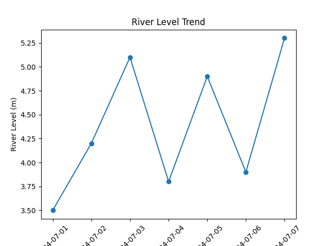

# Flood Risk Prediction System

This project analyzes rainfall and river level data to estimate flood risk levels. 
The system visualizes flood trends using graphs to help understand potential flood patterns.

## Features

- Rainfall data analysis
- Flood risk classification
- Graph visualization using matplotlib
- Data stored in CSV files

## Technologies Used

- Python
- Pandas
- Matplotlib

## Output

